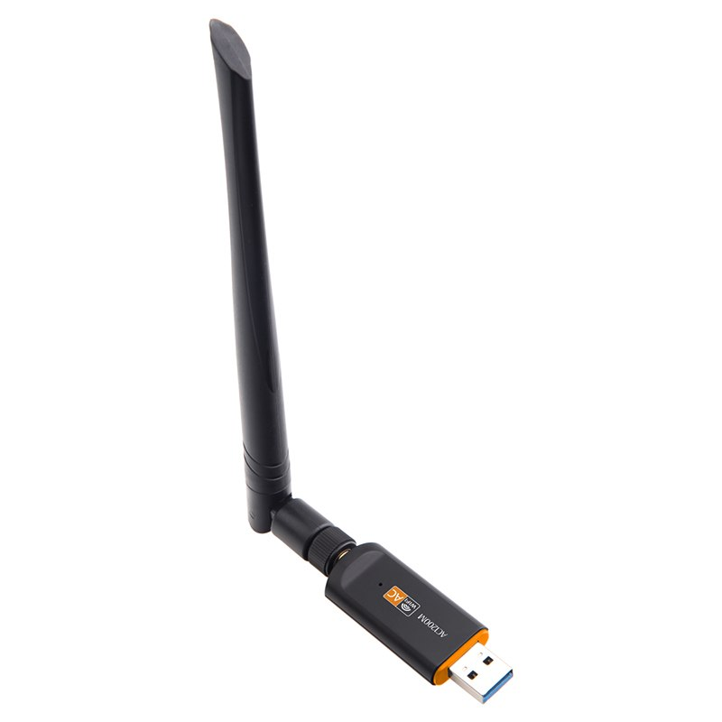

# Realtek Rtl8812BU 802.11ac usb wifi adapter driver

 

  
## RTL8812BU Software  &nbsp; &nbsp; &nbsp; &nbsp;&nbsp; &nbsp; &nbsp; &nbsp; &nbsp; &nbsp; &nbsp; &nbsp; &nbsp; &nbsp; &nbsp; &nbsp; &nbsp; &nbsp;&nbsp; &nbsp; &nbsp; &nbsp; &nbsp; &nbsp;&nbsp; &nbsp; &nbsp; &nbsp; &nbsp; &nbsp; &nbsp; &nbsp; &nbsp; &nbsp; &nbsp; &nbsp; &nbsp; &nbsp;&nbsp; &nbsp; &nbsp; &nbsp; &nbsp; &nbsp;
For Realtek USB WLAN Family Controller. The driver released on the website only supports the following products: RTL8812AU/RTL8811AU/RTL8192EU/RTL8812BU/RTL8811CU/RTL8814AU: WLAN-only solutions, install WLAN driver

  

### Windows Driver Info

|  Description  |    Version    |   Update Time   |  File Size  |
| ------------- | ------------- | --------------- |------------ |
| 32bit/64bit Windows(7, 8.1, 10) WLAN USB driver (Install Package)  | 1030.25.0701.2017  | 2018/09/07 | 50 MB |

  

---
  

### Tested on Kebidu 1200Mbps USB 3.0 Wireless Wifi Adapter Dual Band

---
  

## License
   [MIT](/LICENSE)

Copyright 2019 © <a href="https://github.com/recepkarademir/Realtek_Rtl8812BU_802.11ac_usb_wifi_adapter_driver" target="_blank"> Realtek Software </a>
